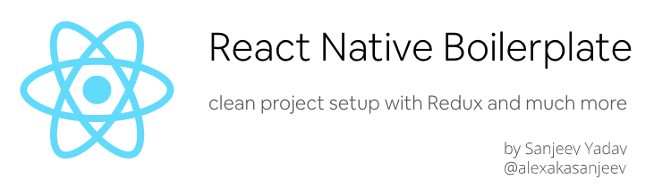

<p align="center">

</p>


[](https://github.com/storybooks/storybook)
[](https://github.com/alexakasanjeev/react-native-boilerplate/issues)

This project is a [React Native](https://reactnative.dev/) boilerplate that  provides **an architecture optimized for building solid cross-platform mobile applications** through separation of concerns between the UI and business logic to help you kickstart your new app

When starting new apps I found myself repeatedly setting up my project with same packages over and over again so I decided to automate this process

This boilerplate consists of various elements and best practices I learned while going though apps written by various talented developers in the React Native Community :zap:

While this mostly consists of how I organize my projects but can be easily extended to suit any workflow :smile:

If you face any issue then feel free to open a issue so we can solve it together :smiley:

**Feel free to leave a :star: as motivation if this was useful to you :smile:**

## 📪 Index

   - [Content](#Content)

   - [Project Structure](#ProjectStructure)

   - [Getting Started](#getting-started)

   - [Rename the project](#RenameProject)

   - [Storybook](#storybook)

   - [Documentations](#Documentations)

## <a name="Content"></a>📦 Content:

    - React Native (0.62.2)
    - Clean Directory Layout
    - Internationalization (i18n)
    - Theme Implementation
    - Storybook Setup
    - Packages:
        - Redux (with redux-saga)
        - React Navigation (version 5)
        - React Native Vector Icons

## <a name="ProjectStructure"></a>🔍 Project Structure:

> [WIP]

## <a name="getting-started"></a>🚀 Getting Started:

1. Clone the repository, by tying this command in terminal

    ```sh
    git clone https://github.com/alexakasanjeev/react-native-boilerplate.git && cd react-native-boilerplate
    ```

    > **Optional**: Make sure to remove the existing git history and initialize the project with your own 

    ``` bash
    rm -rf .git/
    git init
    git add .
    git commit -m 'project init'
    git remote add origin <your remote repo>
    git push -u origin master
    ```

2. Install the dependencies 

    ```bash
    npm install && ( cd ios && pod install )
    ```

### For Android

Run the following command while the emulator is open or a device is connected via adb.

``` 
npx react-native run-android
```

### For iOS

Run the following commands to install pods and run the app on iPhone simulator

``` 
cd ios && pod install && cd ..
npx react-native run-ios
```

## <a name="RenameProject"></a>📝 Rename the project:

Rename the project with the name and bundle identifier of your choosing
**Note**: it is advised to do so in a new branch

``` 
git checkout -b rename
npx react-native-rename <new_name> -b <bundle_identifier>
```

## <a name="storybook"></a>✨ Run Storybook

To run [Storybook](https://storybook.js.org/) follow these steps

1. Change the value of `SHOW_STORYBOOK` variable in [index.js](index.js) from `false` to `true`

2. Open a terminal and run storybook server

    ```bash
    npm run storybook
    ```

3. In another terminal run `npm start` or `yarn start` command to view stories


## <a name="Documentations"></a>📖 Docs

- [Understanding the file structure](documentation/file-structure.md)
- [Theme Module explanation](documentation/how-to-use-theme.md)
- [Contributing to this project](documentation/contributing.md)
- [Roadmap](documentation/roadmap.md)

## 🔔 Updates

The boilerplate will follow latest React Native releases as soon as libraries and tools used here are compatible. I will personally try update this as I use this boilerplate in production :smile:

## 🗃️ Similar project

* [magento_react_native](https://github.com/alexakasanjeev/magento_react_native) - Project using this boilerplate code(almost 😅)

* [React Native Boilerplate](https://github.com/karanpratapsingh/react-native-boilerplate) by [Karan Pratap Singh](https://github.com/karanpratapsingh)

## 📣 Acknowledgements

* [README-Template.md](https://github.com/karanpratapsingh/react-native-boilerplate/blob/master/README.md) by [Karan Pratap Singh](https://github.com/karanpratapsingh)

## ♥️ Donate

If this project help you, or to help acclerate development, you can give me a cup of coffee :smile: :

<a href="https://www.buymeacoffee.com/alexakasanjeev" target="_blank"></a>

## 🛡 License

This project is under the MIT License - see the [LICENSE.md](LICENSE.md) file for details
