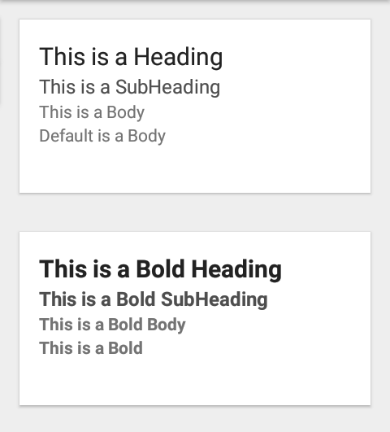

# Theme Module Documentation

This app has inbuilt theme system, which should be used to style the commponents. Designated files are created for colors, spacing, dimensions & typography. Each file contains presets which can be scaled over large number of components.

> **NOTE:** If you don't want to use theme module, simply delete the `theme` folder inside src, and all the components in `common` folder, and simply replace it with [React Native Elements](https://react-native-elements.github.io/react-native-elements/) or [Native Base](https://nativebase.io/) or else.

## Table of Contents
- [ThemeProvider](#theme-provider)- component
- [Theme/Colors](#colors) - set of pre-defined colors for a theme
- [Typography](#typography) - all typography related styles
- [Spacing](#spacing) - common padding/margin value
- [Dimensions](#dimens) - component custom width/height are defined here

## <a name="theme-provider"></a> ThemeProvider

[`ThemeProvider`](../src/theme/ThemeProvider.js) is React component, which holds the theme that need to be apply across all the component.

1. Wrap your top level App component with [`ThemeProvider`](../src/theme/ThemeProvider.js) and pass a default theme

    ```javascript
    //...
    import { ThemeProvider, lightTheme } from './theme';

    export default App(){
      return (
        <ThemeProvider theme={lightTheme}>
          <Navigation />
        </ThemeProvider>
      );
    }
    ```

2. Access theme in your component using React Context API
  
    > For Functional Component
    ```javascript
    import React, { useContext } from 'react';
    import { ThemeContext } from '../theme';
    //...
    const CustomComponent = props => {
      const { theme } = useContext(ThemeContext);
      //...
      return <View style={{ backgroundColor: theme.backgroundColor }} />
    }
    ```

    > For Class Component
    ```javascript
    //...
    import { ThemeContext } from '../theme';

    class CustomComponent  extends React.Component {
      static contextType = ThemeContext;
      //...
      render() {
        const { theme } = this.context;
        return <View style={{ backgroundColor: theme.backgroundColor }} />;
      }
    }
    ```

## <a name="colors"></a> :art: Theme/Colors

A single theme is a collection of several colors. The Color palette is inspired from [Google Material Design](https://material.io/design/color/the-color-system.html) color system. There is one major color `primary` which should be used for all component primary color. You can add `secondary` & `tertiary` as requirements unfolds [here](../src/theme/lightTheme.js)

| Color Name | Color Use |
|---|---|
| primaryColor | To be used as background color for components which denotes **primary action**.<br/>A primary color is the color displayed most frequently across your app’s screens and components |
| primaryLightColor | Lighter shade of primary color, (can be used for hover effects) |
| primaryDarkColor | Darker shade of primary color, (can be used for border color or text color of components) |
| backgroundColor | The background color appears behind scrollable content |
| surfaceColor | Surface colors affect surfaces(background) of components, such as cards, sheets, and menus |
| borderColor | To be used for border anywhere in the component |
| disabledColor | Color which will replace primary color, when component is in disabled state |
| disabledDarkColor | To be used for border color & text color of disabled component |
| headingTextColor | To be used for heading text |
| subHeadingTextColor | To be used for sub-heading text |
| bodyTextColor | To be used for normal text, like paragraph |
| successColor | Green shade for success messages and icons |
| errorColor | Red shade for error messages and icons |

> If `surface` is dark make `headingTextColor`, `subHeadingTextColor` & `bodyTextColor` light, and vice versa.

> **Note**: Avoid creating custom colors in general, until & unless you can't get away with above colors

### Usage

:heavy_check_mark: Do this

```javascript
<View style={{ backgroundColor: theme.surfaceColor }}>
    <View style={{ borderColor: theme.borderColor }}>
```
:x: Don't do this

```javascript
<View style={{ backgroundColor: '#222' }}>
    <View style={{ borderColor: '#eee' }}>
```

## <a name="typography"></a> :black_nib: Typography

To avoid changing of text styles at several places, certain pre-defined typography styles has been defined in [`typography.js`](../src/constants/typography.js). The classes can be expanded as per the need.

A custom [`Text`](../src/common/Text/Text.js) component has been defined in `common` folder, which uses these typography styles.

| Name | value | variant |
|---|---|---|
| headingText | Use the Heading style for card titles | bold |
| subheadingText | Use the Subheading style to denote new sections within cards | bold |
| bodyText | Default text style | bold |

> Scale the types, like `label`, `caption` as requirements unfold.

### Usage

import [`Text`](../src/common/Text/Text.js) from component folder, not from `react-native` package

:heavy_check_mark: Do this

```javascript
import { Text } from '../common';
```
:x: Don't do this

```javascript
import { Text } from 'react-native';
```
<hr />

```javascript
<Text type="heading">This is a Heading</Text>
<Text type="subheading">This is a SubHeading</Text>
<Text type="body">This is a Body</Text>
<Text>Default is a Body</Text>
---
<Text type="heading" bold>This is a Bold Heading</Text>
<Text type="subheading" bold>This is a Bold SubHeading</Text>
<Text type="body" bold>This is a Bold Body</Text>
<Text bold>This is a Bold</Text>
```



## <a name="spacing"></a> :straight_ruler: Spacing

Spacing should be consistent and whitespace should be thought as a first class technique up there with color and typefaces. Pre-define presets for spacing which will be used for `padding` and `margin` value. 

| Name | Value |
|---|---|
| tiny | 4 |
| small | 8 |
| medium | 12 |
| large | 16 |

> If required, add more like `extraLarge` etc.

### Usage

:heavy_check_mark: Do this

1. Import `SPACING` object defined in [`spacing.js`](../src/constants/spacing.js) file from `constants` folder

    ```
    import { SPACING } from '../constants';
    ```

2. Use `SPACING` variable to access presets

    ```javascript
    <View style={{ padding: SPACING.large }}>
        <Text style={{ margin: SPACING.tiny }}>
    ```

:x: Don't do this

```javascript
<View style={{ padding: 16 }}>
    <Text style={{ margin: 4 }}>
```

## <a name="dimens"></a> :triangular_ruler: Dimensions

App contain several custom values from image height, width to a view border radius etc. Define all numerical sizes used in app in [`dimens`](../src/constants/dimensions.js) file.

### Usage

1. To define sizes related to some custom component present in `HomeScreen`, write this in [`dimens`](../src/constants/dimensions.js) file

    ```javascript
    {
      homeScreen: {
        customComponentHeight: 234,
        customComponentWidth: 345,
      }
      //...
    }
    ```

2. Then import `DIMENS` object defined in `dimens.js` file from `constants` folder

    ```javascript
    import { DIMENS } from '../constants';
    ```

3. In you `HomeScreen` access the property like this

    ```javascript
    export default HomeScreen() {
      return (
        <CustomComponent style={{
            width: DIMENS.homeScreen.customComponentWidth,
            height: DIMENS.homeScreen.customComponentHeight,
        }}>
      )
    }
    ```

**Points to Remember**

- Try to use existing values present in above files
- Avoid creating new values or styles
- If some component need very specific design which goes against the general guideline, then create custom styles for it
